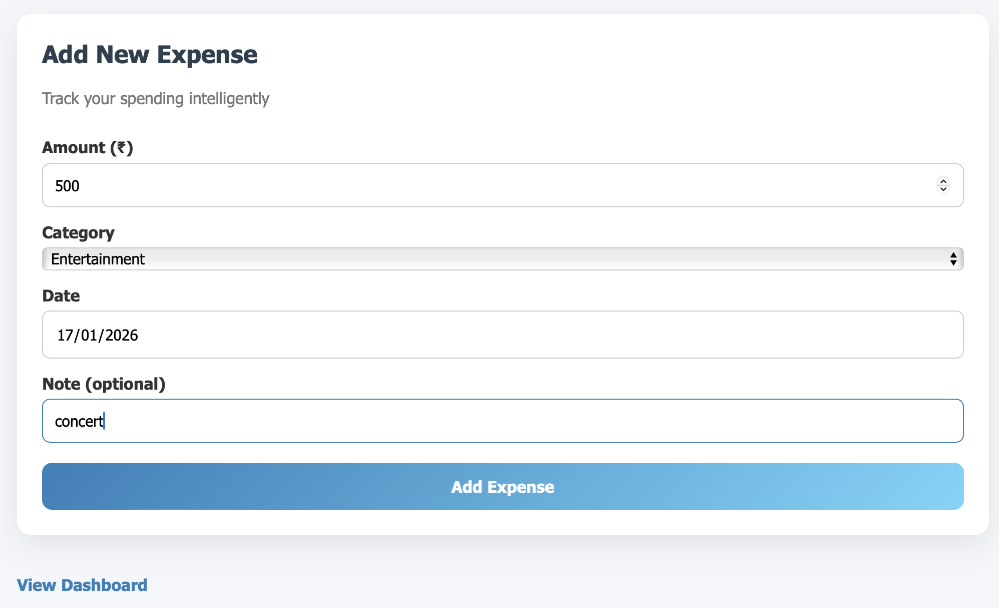
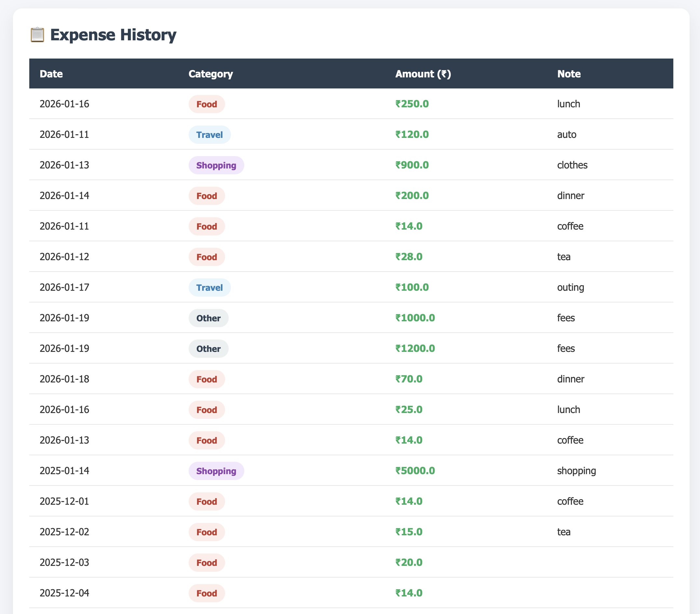
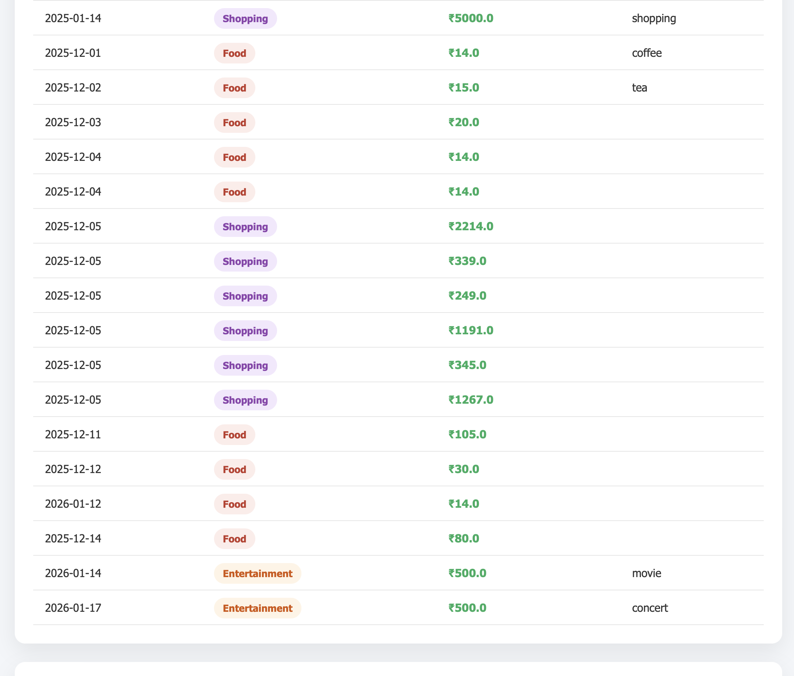
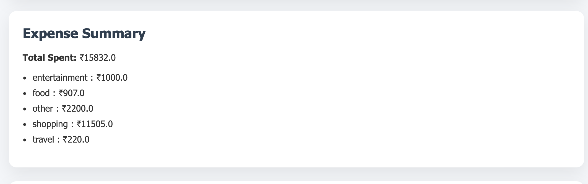
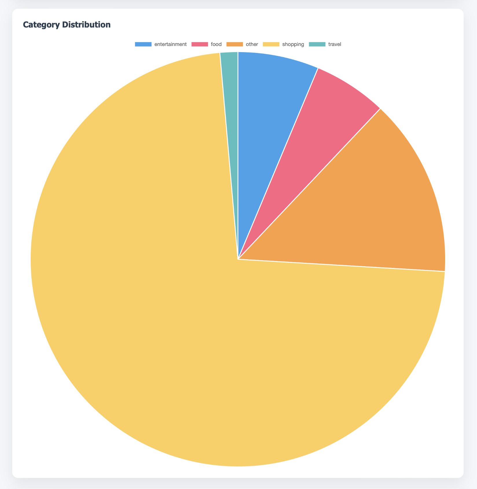
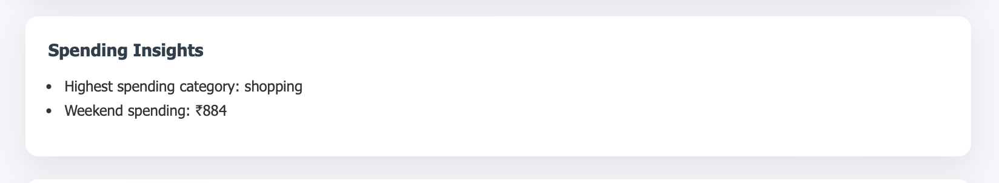
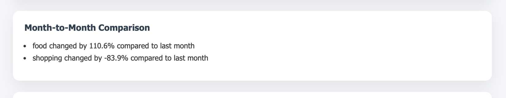
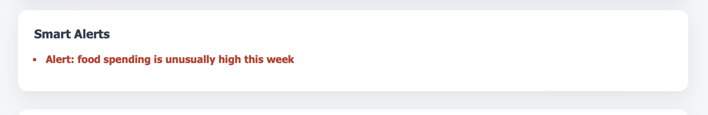
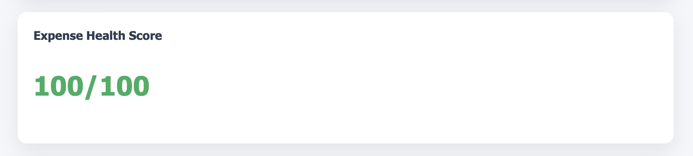

# Smart Expense Analyser

A full-stack web application to track, categorize, and analyze personal expenses.

## Tech Stack
- Python (Flask)
- SQLite
- HTML, CSS, JavaScript

## Features
- Add expenses
- View expense list
- Expense categorization
- Basic expense analysis

## Project Output

### Add Expense

### Dashboard
### Expense List

### Expense Summary

### Expense Analysis

### Spending Insights

### Month-to-Month Comparison

### Smart Alerts

### Expense Health Score

### Smart Suggestions

